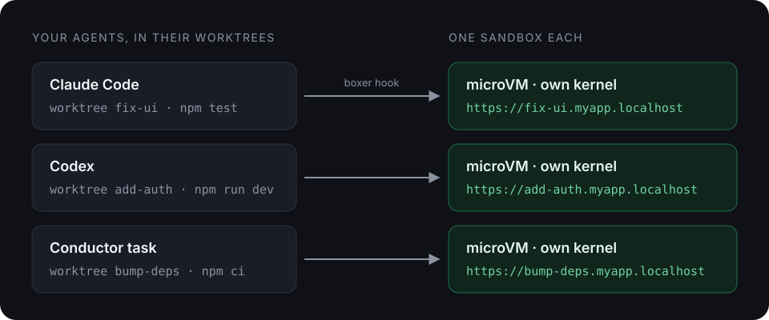

# boxer

**Parallel coding agents, each in its own sandbox.** boxer gives every git worktree its own
microVM, dev server and URL. Install it into your agent once, and every task it starts is isolated
from your machine and from the others.

[](https://github.com/BarakChamo/boxer/actions/workflows/ci.yml)
[](https://github.com/BarakChamo/boxer/releases)
[](LICENSE)

<p align="center">
  
</p>

**[Documentation](https://barakchamo.github.io/boxer/docs)** ·
[Quickstart](https://barakchamo.github.io/boxer/docs/quickstart) ·
[Compared with](https://barakchamo.github.io/boxer/docs/comparison)

## Highlights

- **A sandbox per worktree**, created when an agent starts working there. This includes worktrees
  the agent or an orchestrator creates.
- **No change to your agent.** A hook rewrites `npm test` into the sandbox before the shell runs it.
  Output and exit codes come back as usual.
- **No more port clashes.** Every worktree serves port 3000 inside its sandbox, and gets its own
  host port outside, or a named `https://<branch>.<repo>.localhost` URL with
  [portless](https://github.com/vercel-labs/portless).
- **A real boundary.** Each sandbox is a microVM with its own kernel. It sees only the worktree, and
  reaches only the hosts you allow.
- **33 ms per command** in a running sandbox, within 4 ms of `docker exec`. A Next.js session is
  ready in 7.6 s, against 6.8 s with no sandbox.
- **Works with 10 coding agents and 6 orchestrators**, including Claude Code, Codex, Gemini CLI,
  OpenCode, Conductor and T3 Code. Most are tested with live models in a 55-setup matrix.
- **Local and open source.** No account, no upload.

## Install

```sh
curl -sSL https://smolmachines.com/install.sh | bash                            # smolvm, the microVM runtime
curl -fsSL https://raw.githubusercontent.com/BarakChamo/boxer/main/install.sh | sh    # boxer
```

Or `go install github.com/BarakChamo/boxer/cmd/boxer@latest`. macOS on Apple Silicon, Linux on
x86-64 or arm64.

## Get started

```sh
cd your-repo
boxer install claude-code
git add .claude .mcp.json && git commit -m "Run agent commands in boxer"
```

That is the setup. From then on:

1. **A session starts in a worktree.** boxer creates that worktree's sandbox, runs your `setup`,
   starts your dev server, and tells the agent where it is.
2. **The agent runs `npm test`.** The hook runs it in the sandbox. The agent sees the normal output.
3. **Another session starts in another worktree.** It gets its own sandbox, with its own ports,
   tools and processes.
4. **A worktree is deleted.** boxer removes its sandbox in the background.

```console
$ boxer ls        # two agent sessions, two worktrees (some columns left out)
NAME         STATE    BRANCH    SERVES
mild-lynx    running  add-auth  https://add-auth.myapp.localhost:1355
olive-comet  running  fix-ui    https://fix-ui.myapp.localhost:1355
```

`git`, `gh` and `ssh` stay on your machine. The [Quickstart](https://barakchamo.github.io/boxer/docs/quickstart)
covers the details.

## Works with

| Agent | Setup |
| --- | --- |
| Claude Code | `boxer install claude-code` |
| Codex | `boxer install codex`, then trust the hooks and turn off Codex's own sandbox ([why](https://barakchamo.github.io/boxer/docs/setup/codex)) |
| Gemini CLI | `boxer install gemini-cli` |
| Copilot CLI | `boxer install copilot --user` |
| OpenCode | `boxer install opencode` |
| pi | `boxer install pi` |
| Grok | `boxer install grok` |
| Kimi Code, DSH | `boxer install kimi`, `boxer install dsh`, plus tool mode |
| fx, or any other agent | `boxer shell <harness>` runs the agent itself in the sandbox |

Orchestrators: [Conductor, T3 Code, Paperclip, herdr, Multica and
OpenHands](https://barakchamo.github.io/boxer/docs/orchestrators).

## Find your path

| You are | Start here |
| --- | --- |
| Using Claude Code or Codex | [Quickstart](https://barakchamo.github.io/boxer/docs/quickstart) |
| Running Conductor, T3 Code or another orchestrator | [Orchestrators](https://barakchamo.github.io/boxer/docs/orchestrators) |
| Managing containers with your own scripts and hooks | [Coming from your own scripts](https://barakchamo.github.io/boxer/docs/configure/from-scripts) |
| Using Docker, your own images, or services like Postgres | [Bring your Docker setup](https://barakchamo.github.io/boxer/docs/configure/docker) |
| New to containers and VMs | [What is boxer](https://barakchamo.github.io/boxer/docs), then the Quickstart |

## Configure your project

A `boxer.toml` at the repository root describes the sandbox. Without one, boxer picks an image from
your lockfile.

```toml
image = "mirror.gcr.io/library/node:24-alpine"
setup = ["npm ci"]                        # once per worktree
start = ["npx next dev -H 0.0.0.0 -p 3000"]   # listen on 0.0.0.0
ready = "wget -q -O /dev/null http://127.0.0.1:3000/"

[network]
allow_hosts = ["registry.npmjs.org"]      # everything else is blocked
ports = ["auto:3000"]                     # a free host port per worktree

[urls]
enabled = true                            # https://<branch>.<repo>.localhost:1355, needs portless
```

[Examples](examples/) cover Next.js, Vite, Python, Go and monorepos.
[Configuration](https://barakchamo.github.io/boxer/docs/reference/configuration) lists every key.

## Backends

| Backend | Isolation | Egress allowlist |
| --- | --- | --- |
| smolvm (default) | own kernel per sandbox | yes |
| Apple `container` | own kernel per sandbox | no |
| docker, podman | one shared kernel | no |

Set `backend = "docker"` and `network.mode = "on"` in `boxer.toml` to switch. You do not need
smolvm then. See [Backends](https://barakchamo.github.io/boxer/docs/backends) and
[Bring your Docker setup](https://barakchamo.github.io/boxer/docs/configure/docker).

## Documentation

- [What is boxer](https://barakchamo.github.io/boxer/docs) and the [Quickstart](https://barakchamo.github.io/boxer/docs/quickstart)
- [Set up your agent](https://barakchamo.github.io/boxer/docs/setup) and [your orchestrator](https://barakchamo.github.io/boxer/docs/orchestrators)
- [Set up your project](https://barakchamo.github.io/boxer/docs/configure/environment): images, dependencies, dev servers, URLs
- [Security](https://barakchamo.github.io/boxer/docs/concepts/security): what is isolated and what is not
- [CLI](https://barakchamo.github.io/boxer/docs/reference/cli), [Go package and JSON](https://barakchamo.github.io/boxer/docs/reference/building-on-boxer)
- [Evaluations](https://barakchamo.github.io/boxer/docs/evals) and [benchmarks](https://barakchamo.github.io/boxer/docs/evals/benchmarks)

## Development

```sh
make build    # bin/boxer
make test     # unit tests, race detector, coverage floors
make smoke    # every configuration path against a real sandbox
make docs-dev # the docs site on localhost
```

See [CONTRIBUTING.md](CONTRIBUTING.md) and [docs/architecture.md](docs/architecture.md).

## License

Apache-2.0. Report vulnerabilities as described in [SECURITY.md](SECURITY.md).
